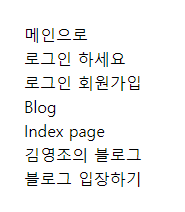
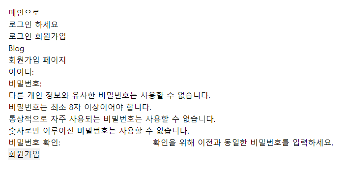
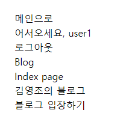
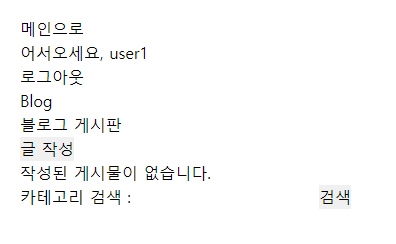
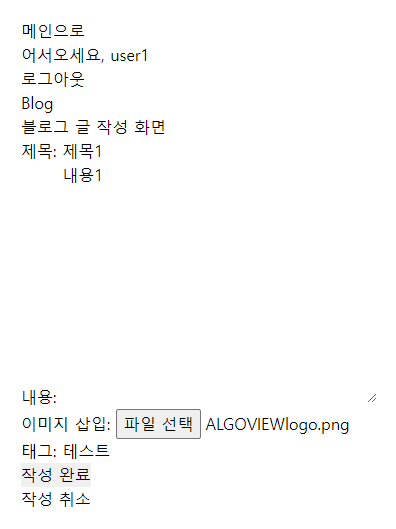
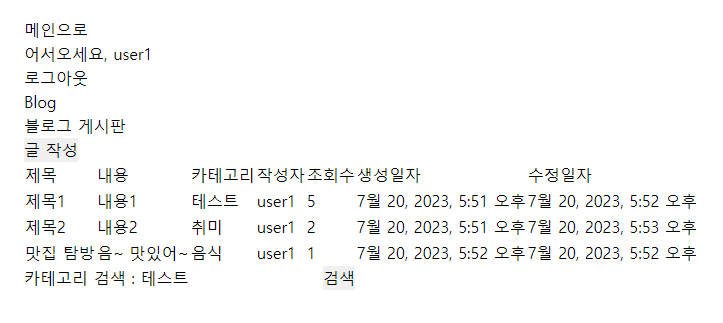
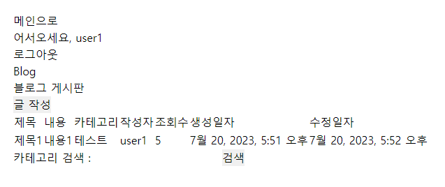
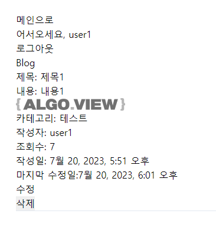
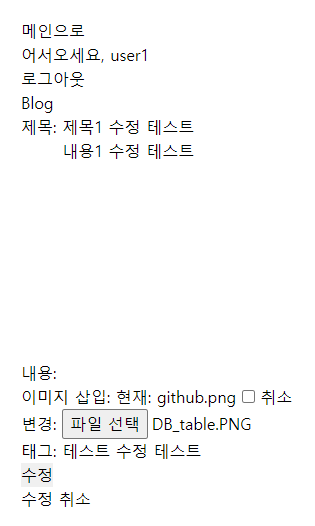
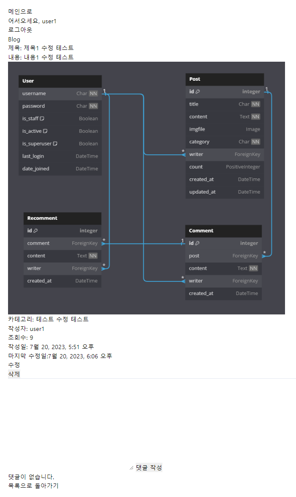

# Django Blog

## 1. 목표 및 기능

### 1.1 목표
* Django를 이용하여 CRUD 기능 구현

### 1.2 기능
* 회원가입, 로그인, 로그아웃
* 게시글 CRUD
* 게시글 검색
* 게시글 조회수 표시
* 게시글 이미지 업로드
* 댓글 CRD
* 대댓글 CRD

## 2. 배포 URL
* 미완성

## 3. 프로젝트 구조 및 개발 일정

### 3.1 프로젝트 구조
```
project_django_blog
└─blogapp
     ├─app
     ├─blog
     |  ├─migrations
     |  └─templates
     |        └─blog
     ├─media
     ├─templates
     ├─user
     |  ├─migrations
     |  └─templates
     |        └─user
     └─venv
```

### 3.2 DB 구조


### 3.3 개발 일정
* 2023.07.17 ~ 2023.07.20

## 4. 동작 화면
* 메인화면



* 회원가입



* 로그인



* 블로그 첫 화면



* 글 작성 화면



* 글 작성된 화면



* 카테고리 검색 화면



* 상세보기 화면



* 글 수정 화면



* 글 수정된 화면

