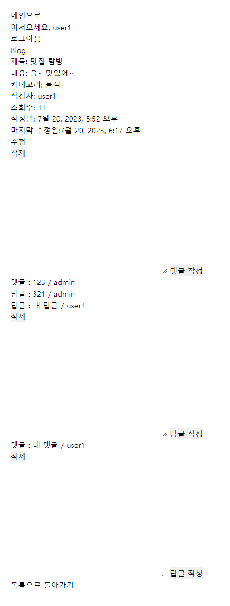
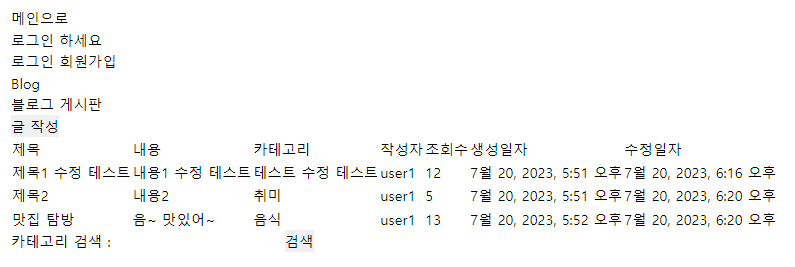
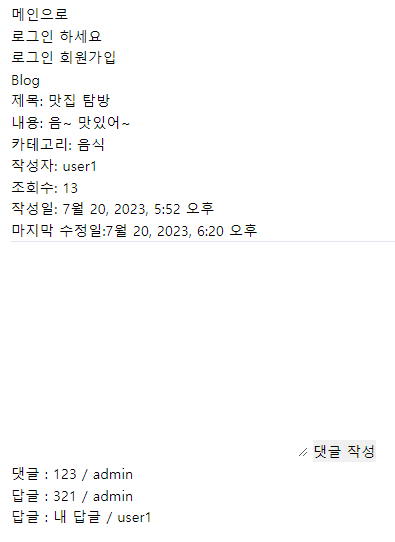

# Django Blog

## 1. 목표 및 기능

### 1.1 목표
* Django를 이용하여 CRUD 기능 구현

### 1.2 기능
* 회원가입, 로그인, 로그아웃
* 게시글 CRUD
* 게시글 검색
* 게시글 조회수 표시
* 게시글 이미지 업로드
* 댓글 CRD
* 대댓글 CRD

## 2. 개발 환경 및 배포 URL

### 2.1 개발 환경
* python==3.11.3
* Django==3.2
* Pillow==10.0.0

### 2.2 배포 URL
* 미배포

## 3. 프로젝트 구조 및 개발 일정

### 3.1 프로젝트 구조
```
project_django_blog
└─blogapp
     ├─app
     ├─blog
     |  ├─migrations
     |  └─templates
     |        └─blog
     ├─media
     ├─templates
     ├─user
     |  ├─migrations
     |  └─templates
     |        └─user
     └─venv
```

### 3.2 ERD 구조


### 3.3 개발 일정
* 2023.07.17 ~ 2023.07.20

## 4. 동작 화면
* 메인화면


* 회원가입


* 로그인


로그인 시 기존 url로 넘어갑니다.

* 블로그 첫 화면


* 글 작성 화면


* 글 작성된 화면


* 카테고리 검색 화면


* 상세보기 화면


* 글 수정 화면


* 글 수정된 화면


* 댓글, 대댓글 화면



* 로그아웃 유저 화면


